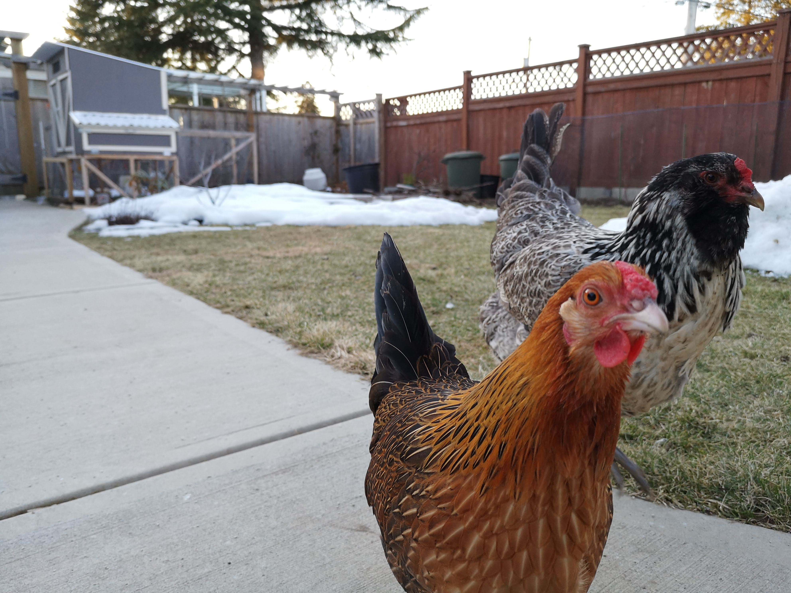

# Automatic Chicken Coop Door

Automatic chicken coop door for my backyard egg layers. Modeled after the commercially available [Chicken Guard](https://www.chickenguard.com/).

## Parts List
- Arduino Pro Mini
- Monochrome 128x32 I2C OLED
- DS3231 RTC with CR2032 Battery
- 6V 10rpm 25GA Brushed DC Motor
- TB6612FNG Motor Driver
- XL6009 Buck Boost Module

## Dependencies
- [Low Power](https://github.com/rocketscream/Low-Power)
- [Motor Driver TB6612FNG](https://github.com/sparkfun/SparkFun_TB6612FNG_Arduino_Library)
- [FabioCuomo-DS3231](https://github.com/FabioCuomo/FabioCuomo-DS3231)
- [SSD1306 1.2.9](https://github.com/adafruit/Adafruit_SSD1306)
- [GFX 1.4.2](https://github.com/adafruit/Adafruit-GFX-Library)

## How It Works

The main program sets alarms to wake up from sleep based on sunrise/sunset times (from [here](https://www.timeanddate.com/sun/canada/vancouver?month=1&year=2019)). These times are consistent year after year, and is more reliable than using a light sensor which can be finicky to adjust for street lamps, headlights from passing cars, etc.

## Power Consumption

- Powered on = 18.35 mA
- Motor on = 320 mA (no load), ~700 mA (load)
- Sleep = 0.94 mA
